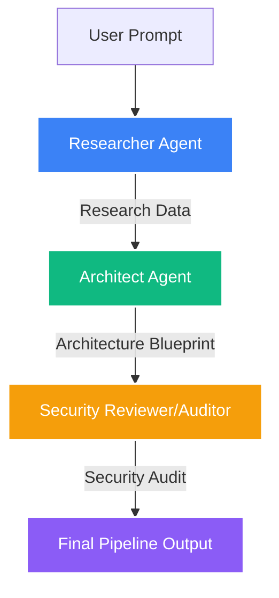

# ◈ Aether Flow

**Autonomous Multi-Agent AI Orchestrator**


[](https://www.typescriptlang.org/)
[](https://tailwindcss.com/)


[](https://opensource.org/licenses/MIT)

Aether Flow is a premium, low-latency AI orchestration engine that leverages a multi-agent "Sequential Handoff Pipeline" to transform raw technical requirements into secure, audited architecture blueprints. Built with **React 19**, **TypeScript**, and **Gemini 2.5**, it features a deterministic execution flow powered by a robust Finite State Machine (FSM).

---

## 🏗️ Architecture Flow



---

## � Key Features

- **Real-time Scrambling UI**: Dynamic text decryption effects for agent outputs, providing a high-fidelity "terminal-reveal" experience.
- **Chain of Verification**: Every architectural decision is audited by a specialized Security Reviewer to prevent "Context Drift" and ensure safety.
- **Deterministic Execution Flow**: A strict sequential pipeline managed via Zustand, ensuring predictability and state integrity.
- **Low-latency Observability**: Integrated with OpenTelemetry patterns for deep pipeline introspection and performance monitoring.
- **Enterprise-Ready Integration**: Pre-architected for Kafka/Pulsar data streams and OpenTelemetry telemetry.

---

## ⚙️ The Engine: Sequential Handoff Pipeline

The core orchestration logic resides in `src/services/ai/geminiService.ts` and `src/features/agents/useOrchestrator.ts`. It follows a rigid-yet-flexible pipeline where each agent consumes the specialized output of its predecessor.

1.  **Researcher (🔬)**: Scans technical requirements and identifies core metrics.
2.  **Architect (🏗️)**: Constructs a full-stack blueprint based on research findings.
3.  **Security Reviewer (🛡️)**: Conducts an automated vulnerability audit on the blueprint.

---

## � The State: Persistent Shared Context

Aether Flow utilizes a **Persistent Shared Context** pattern managed in `src/store/orchestratorStore.ts`. This prevents the "Context Drift" common in long-running LLM chains by ensuring each agent has access to a verbatim, tamper-proof record of the pipeline's history.

---

## 🛠️ Technical Stack

- **Frontend**: React 19 (Vite), Framer Motion (Animations)
- **State**: Zustand (Store-level isolation)
- **AI**: Gemini 2.5 Flash (via `@google/generative-ai`)
- **Infrastructure**: OpenTelemetry (Observability), Kafka/Pulsar (Planned Stream Integration)
- **Styling**: Vanilla CSS with modern Glassmorphism foundations.

---

## 🏁 Getting Started

1.  **Clone the Repo**:
    ```bash
    git clone https://github.com/your-repo/aether-flow.git
    cd aether-flow
    ```
2.  **Install Dependencies**:
    ```bash
    npm install
    ```
3.  **Set Environment Variables**:
    Create a `.env` file:
    ```env
    VITE_GEMINI_API_KEY=your_api_key_here
    ```
4.  **Run Development Server**:
    ```bash
    npm run dev
    ```

---

## � Development

The project structure is optimized for feature-based development:
- `src/features/agents`: Orchestration hooks and agent UI components.
- `src/services/ai`: Core Gemini integration and prompt engineering.
- `src/store`: Global state management and FSM logic.

---

## 🧪 Testing

Aether Flow maintains a rigorous testing suite using **Vitest** and **React Testing Library**.

```bash
# Run unit tests
npm run test

# Generate coverage report
npm run coverage
```

---

## 🗺️ Roadmap

- [ ] Multi-path Parallel Orchestration
- [ ] Visual Logic Designer (Node-based)
- [ ] Real-time Kafka Stream Connectors
- [ ] Extended Agent Personalities (FinOps, DevOps)

---

## 📄 License

MIT © 2026 Aether Flow Team
